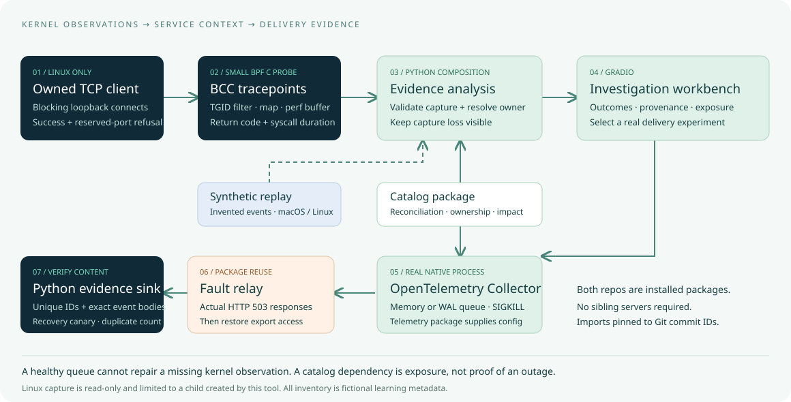

# Fleet Kernel Workbench

**Connect kernel observations to service ownership, then test whether the evidence survives a telemetry failure.**

A Python and Gradio learning project built on two independently installed Python packages: [Fleet Infrastructure Catalog](https://github.com/sivalinb/fleet-infrastructure-catalog) and [Telemetry Reliability Lab](https://github.com/sivalinb/fleet-telemetry-lab).



## What it solves

A connection failure, an unknown service owner, and a dropped observation are different problems. This workbench makes those boundaries visible:

- **What happened?** Linux eBPF observes the return value and duration of `connect` syscalls from a Python child owned by the tool.
- **Who owns the service?** The catalog package reconciles fictional inventory, records field provenance and traverses service dependencies.
- **Can the evidence be trusted?** Capture counters expose missing observations. The telemetry package validates instrumentation and supplies real Collector failure experiments.

The Gradio interface includes connection outcomes, ownership confidence, dependency exposure, delivery assertions, architecture and aggregate JSON exports. Five synthetic scenarios cover healthy connections, refusals, capture loss, missing owners and stale ownership. Three delivery experiments compare outage buffering, persistent queue recovery and memory queue loss.

## Install and run

Requires Python 3.11+ and Git. Both upstream packages are pinned to immutable Git commit IDs in `pyproject.toml`; sibling checkouts and running services are unnecessary.

```bash
python3 -m venv .venv
source .venv/bin/activate
python -m pip install '.[test]'
fleet-kernel ui
```

The interface listens on `http://127.0.0.1:7862`. It runs without elevated privileges. Replay works on macOS and Linux and is visibly labeled synthetic.

For real Collector experiments, install the pinned, checksum-verified native binary:

```bash
python scripts/install_collector.py
fleet-kernel replay --profile capture-loss --delivery durable-crash
```

`KERNEL_COLLECTOR_BINARY` can point to an existing compatible Collector binary. Each experiment starts its own Collector, fault relay and Python evidence sink on local ports. It does not reconfigure either upstream project's running stack.

## Linux eBPF capture

The application, capture controller, workloads, analysis, UI and tests use Python. A small **embedded BPF C** program in `probe.py` is compiled and loaded by BCC; Python itself does not run inside the kernel.

On an Ubuntu Linux learning host with compatible BCC and kernel headers:

```bash
sudo apt-get install python3-venv python3-bpfcc linux-headers-$(uname -r)
/usr/bin/python3 -m venv --system-site-packages .bpf-venv
.bpf-venv/bin/python -m pip install .
sudo .bpf-venv/bin/fleet-kernel doctor
sudo .bpf-venv/bin/fleet-kernel capture --count 12 --output .runtime/owned-capture.json
sudo chown "$(id -u):$(id -g)" .runtime/owned-capture.json
```

Import the JSON through the unprivileged Gradio interface. The CLI records only its own newly spawned loopback workload; it does not accept arbitrary PIDs, commands or network targets. Linux tracing policy must allow the probe. macOS cannot run this Linux capture path natively; use a Linux host or VM. Imported capture origin is self-reported by the file, not cryptographically attested.

## How the packages are used

| Installed package | Reused behavior |
| --- | --- |
| `fleet-infrastructure-catalog` / `fleet_catalog` | SQLAlchemy source model; `Batch` and `Record` validation; `ingest`, `snapshot`, ownership provenance and `impact` traversal |
| `fleet-telemetry-lab` / `fleetlab` | Resource contracts; isolated Collector configuration; owned fault relay process; Collector metric parsing; durable experiment records |
| `fleet-kernel-workbench` / `fleet_kernel` | BCC probe/controller, capture envelope, correlation policy, bounded kernel labels, exact-content evidence sink and Gradio UI |

No upstream implementations are copied or imported through `sys.path` changes. [Package boundaries and architecture](docs/architecture.md) describe the integration.

## Verification

```bash
pytest -m 'not native and not ebpf'
python scripts/install_collector.py
pytest -m native
sudo env KERNEL_LIVE_TEST=1 .bpf-venv/bin/python -m pytest -m ebpf
```

The final command also needs the test extra installed in the BCC environment. Live tests require actual probe attachment and validate real captured observations through persistent Collector recovery. They do not silently fall back to replay. [Test cases and evidence boundaries](docs/testing.md) explain what each suite proves.

## Practical scope

This is a bounded learning system, not a fleet monitoring agent. The catalog contains invented metadata in both modes. A syscall duration is not application latency or network RTT. Pending nonblocking connects are not classified as failures. Dependency exposure is not proof that dependent services failed. A durable queue protects accepted telemetry within its limits; it cannot recreate missing kernel events.

Local runtime data, imported captures, raw event identities and process logs are ignored by Git. Downloads from the UI contain aggregate findings only. See the [eBPF concepts](docs/ebpf.md) and [extension and scaling design](docs/scaling.md).

